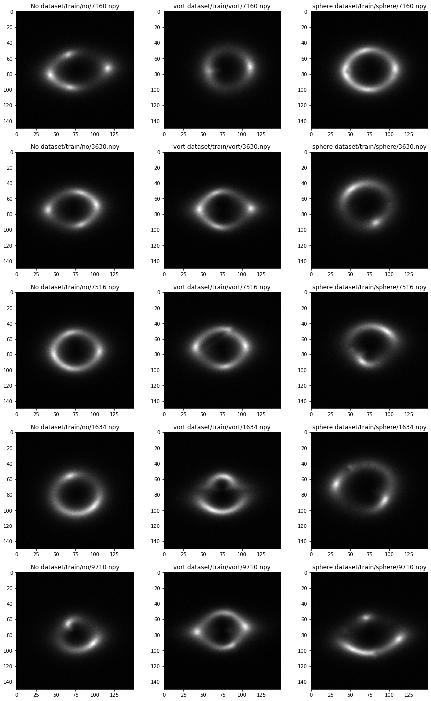
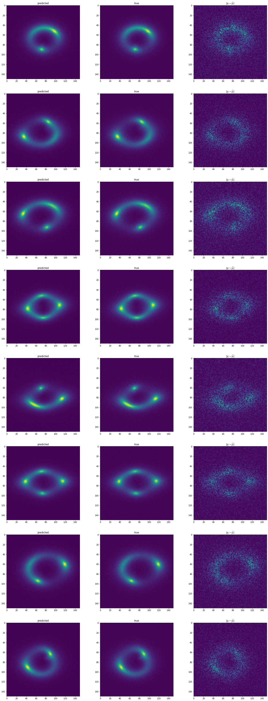
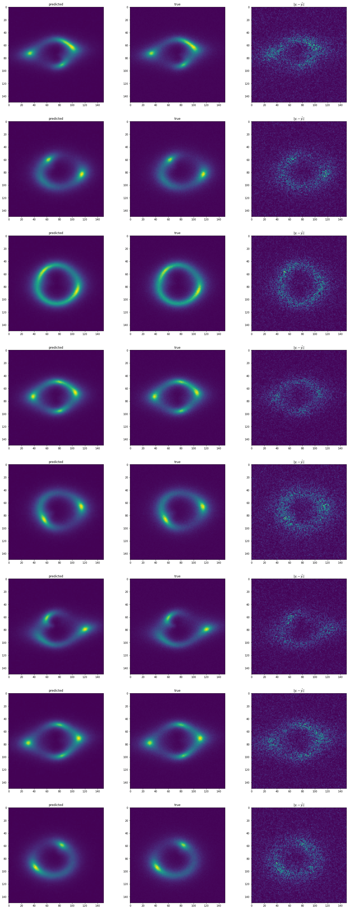
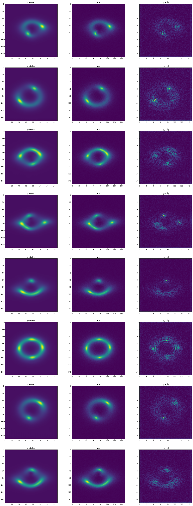
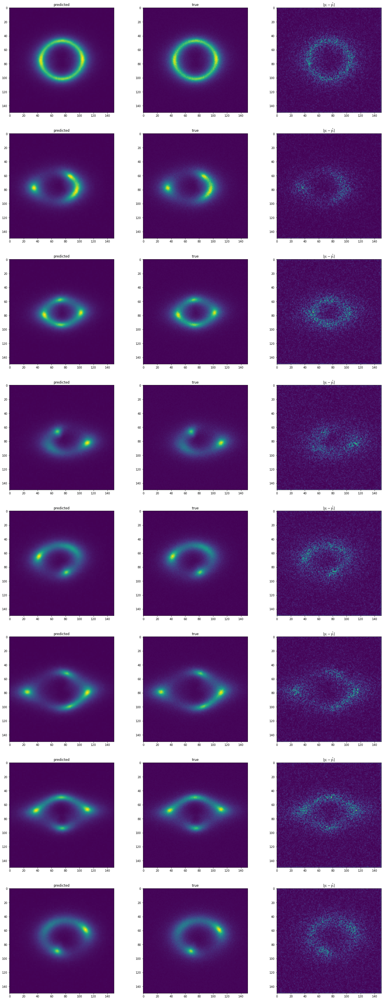
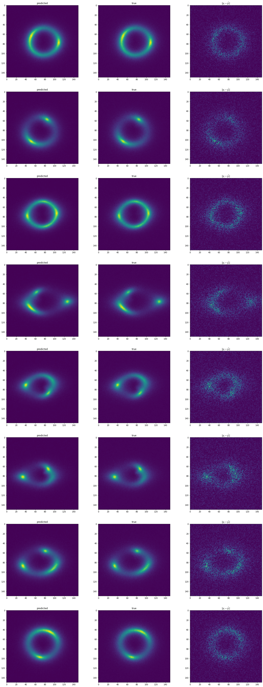
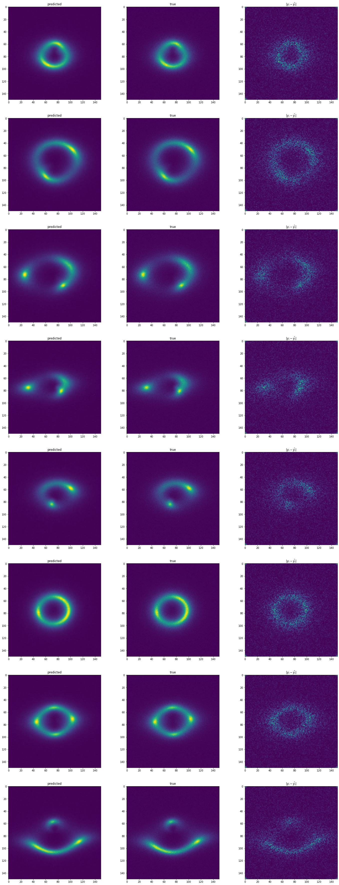
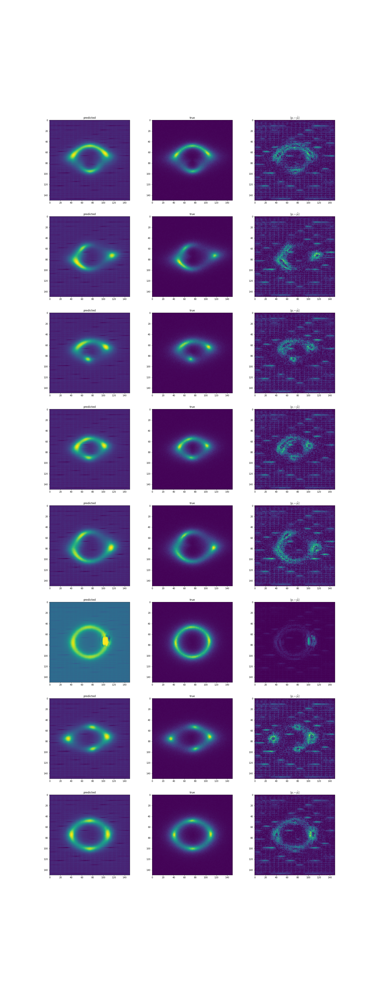

# Common Test I. Multi-Class Classification

## Introduction
The solution for this task can be found in file [DeepLense_pytorch_Task1.ipynb](DeepLense_pytorch_Task1.ipynb). I tried multiple architectures, and training was done entirely on google colab (the dataset is sourced from google drive, and results are also saved there).  
## Problem Statement and EDA ( Exploratory data analysis)
The problem is multi-class classification of strong gravitational lensing (no substructure, subhalo substructure and vortex substructure). The dataset is balanced (for training 30000 images, 10000 per class, 7500 images for validation ,2500 per class), pixel values from images are from [0,1] (min-max prescaling ) and are 1 channel, 125x125 pixel images. For data normalization, the mean is ~ 0.0617 and standard deviation is 0.117   

To know better what exactly does the data look like, the notebook contain some plotting images of data, that can be also seen below

## Trained models 
The following models has been trained Resnet18, Resnet34, Resnet50, Resnet118, Efficient Net b2, Efficient Net b3, Efficient Net b4. All of these achieve quite simillar, good performance. An important factor for training and saving time was using a pretrained network (please see figure ?, it took much more time to train it, and there doesn't seem to be any improvement).

I used pytorch for whole training. All networks has been trained with Adam optimizer with cycling learning rate scheduler (1e-4 to 5e-4). Loss was crossentropy, and recorded metrics was accuracy and AUC ROC (with ROC plots).

|  Name  | Final Accuracy on validation  | Final AUC ROC on validation |
|---|---|---|
| Resnet18 (pretrained)  |  0.9052 | 0.977  |
| Resnet34 (pretrained)  | 0.9257   | 0.985   |
| Resnet50 (pretrained)  |  0.92453 | 0.984  |
| Resnet118 (pretrained)  |  0.92 | 0.9832  |
| Efficient Net b2 (pretrained)  | 0.9184  |  0.9797 |
| Efficient Net b3 (pretrained)  |  0.9204 | 0.9811  |
| Efficient Net b4 (pretrained)  | 0.8812  |  0.9638 |
| Resnet18 (from scratch)  | 0.9173   | 0.9832   |

Generally, all models achieve quite simillar performance with 90-92% accuracy and AUC ~ 0.98. Interestingly, pretrained models achieve very fast good performance, but many models I tried that were trained from scratch had to be run over many epochs to achieve that level of performance (or worse). The scores for all model for comparision is below :

## Access Results
all loss curves and ROC curves can be found here : [task1_curves.md](task1_curves.md).  
all Models can be found on [google drive](https://drive.google.com/drive/folders/1de7yVH_gI6js4bUlJT4WoVOZSlQ7EtkC?usp=sharing) 

# Task 5 
## Introduction
The solution for this task can be found in file [DeepLense_pytorch_Task5.ipynb](DeepLense_pytorch_Task5.ipynb). I tried multiple architectures, and training was done entirely on google colab (the dataset is sourced from google drive, and results are also saved there).  

## Problem Statement and EDA ( Exploratory data analysis)
The problem is anomaly detection ( a binary classification task), where I'm given strong lensing images with and without substructure. dataset consists of 10000 images ( 5000 per class) without validation dataset. Validation dataset was created by randomly taking 1000 images per class and not using it for training. Images are in .png format, pixel values from images are from [0,1] (min-max prescaling ) and are 1 channel, 125x125 pixel images.  

below are the images from the dataset, to visualize the distributions

## Trained models 
The images are very much different distribution that typical dataset that is used for vision transformers (ImageNet, Coco etc.) therefore I thought I probably have to train from scratch rather than finetune. This is problematic, especially that vision transformers do require a lots of data to perform well, so I wanted to start with something simple, so I used Mobile Vision Transformer. This achieved extremely good results : they achieved 95-97% accuracy and 99% AUC ROC ( the metrics plotted below). The models I used are very simple in comparision to other vision transformers (300k parameters) and given the suprisingly good results, I decided just to submit these: 

Best Mobile Vision Transformer achieved accuracy of 97% and AUC ROC of 0.9980 on validation set. 

## Access Results
all Models can be found on [google drive](https://drive.google.com/drive/folders/1pz2Qwlye4vUMo444zSUj0fEskbxZnNVv?usp=sharing) 

# Task 6 
## Introduction
The solution for this task can be found in file [DeepLense_keras_Task6.ipynb](DeepLense_keras_Task6.ipynb). I tried multiple architectures, and training was done entirely on google colab (the dataset is sourced from google drive, and results are also saved there).  

## Problem Statement EDA ( Exploratory data analysis)
The problem is convert lower image resolution images (75 x 75px) to higher resolution images (150 x 150 px). The dataset contains 10000 images, pixel values from images are from [0,1].  

## Trained Models
For that task I used 4 different architectures : SRCNN (classical, very small CNN-based SR model), SRResNet (CNN-based SR model, general improvement over SRCNN), ESRN ( general improvement over SRResNet) and SRGAN (GAN-based, very difficult to train, but overall GAN-based approaches can provide much better results). All models were trained with Adam optimizer. Loss metric was either MSE and SSIM. Recorded metrics was MSE and PSNR (Peak Signal-to-Noise Ratio)

562/562 [==============================] - 77s 137ms/step - loss: 0.0254 - mean_squared_error: 6.5632e-05 - PSNR: 41.8638 - val_loss: 0.0254 - val_mean_squared_error:  - val_PSNR: 

|  Name  | Final MSE on validation  | Final PSNR on validation |
|---|---|---|
| SRCNN  |  6.5708e-05 | 41.8620  |
| SRResNet, blocks=1, MSE  |  5.8668e-05 | 42.3499  |
| SRResNet, blocks=1, SSIM |  6.4173e-05 |  41.9639 |
| SRResNet, blocks=1, SSIM, learned deconvolutions |   1.6374e-04 | 37.9668  |
| SRResNet, blocks=2, MSE  | 5.9286e-05   | 42.3033   |
| SRResNet, blocks=3, MSE  |  6.2869e-05 | 42.0521  |
| ESRN, blocks=1  |  6.5546e-05 | 41.8775 |
| ESRN, blocks=4  |  6.7932e-05 | 41.7189 |
| ESRN, blocks=8  |  6.7379e-05 | 41.7503 |
| SRGAN  | Unstable  |  Unstable |

## Access Results
all Models can be found on [google drive](https://drive.google.com/drive/folders/1n6SBRGFXojVkS7wzw9qd1bzwOMEyKpTO?usp=sharing) 

## Predicted Images
### SRCNN

###  SRResNet, blocks=1, MSE

###  SRResNet, blocks=1, SSIM

###  SRResNet, blocks=1, SSIM, learned deconvolutions

###  SRResNet, blocks=2, MSE

###  SRResNet, blocks=3

###  ESRN, blocks=1

###  ESRN, blocks=4

###  ESRN, blocks=8

###  SRGAN

