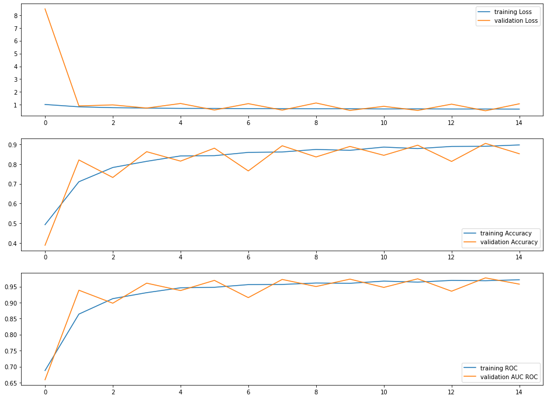
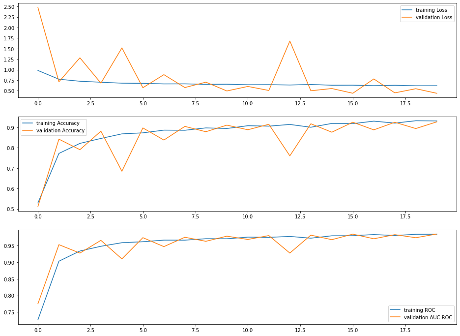
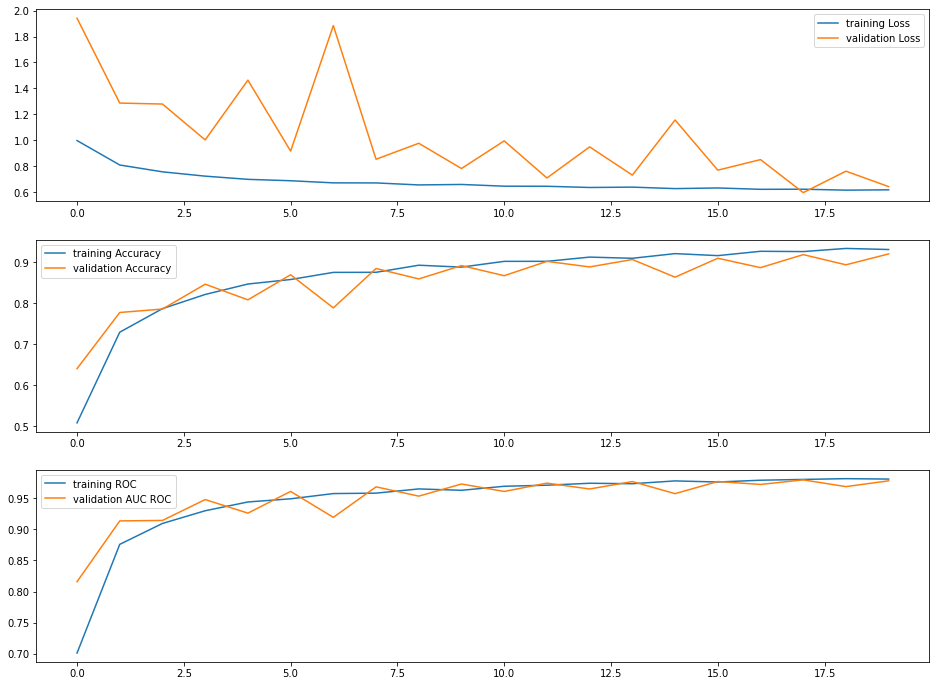
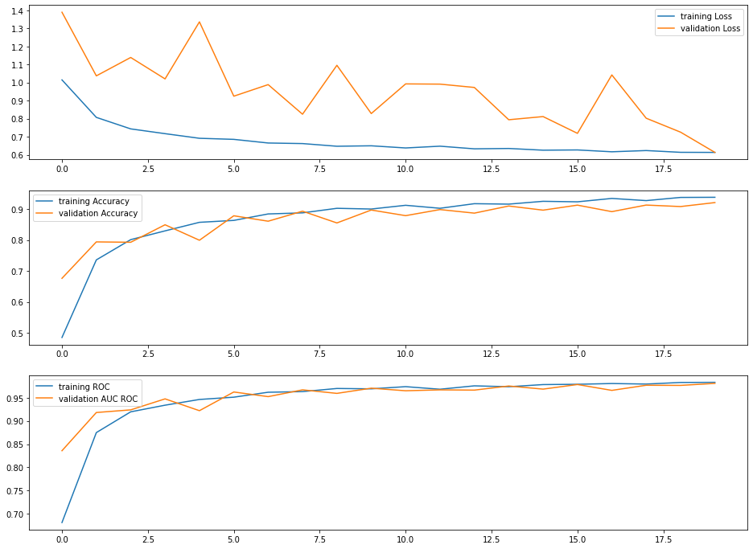
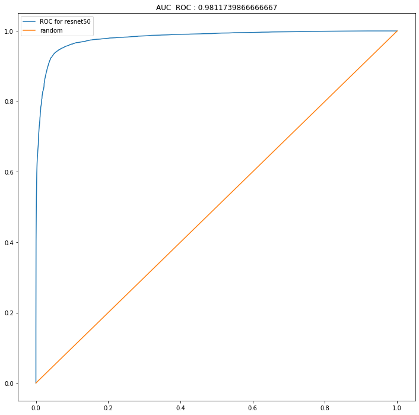
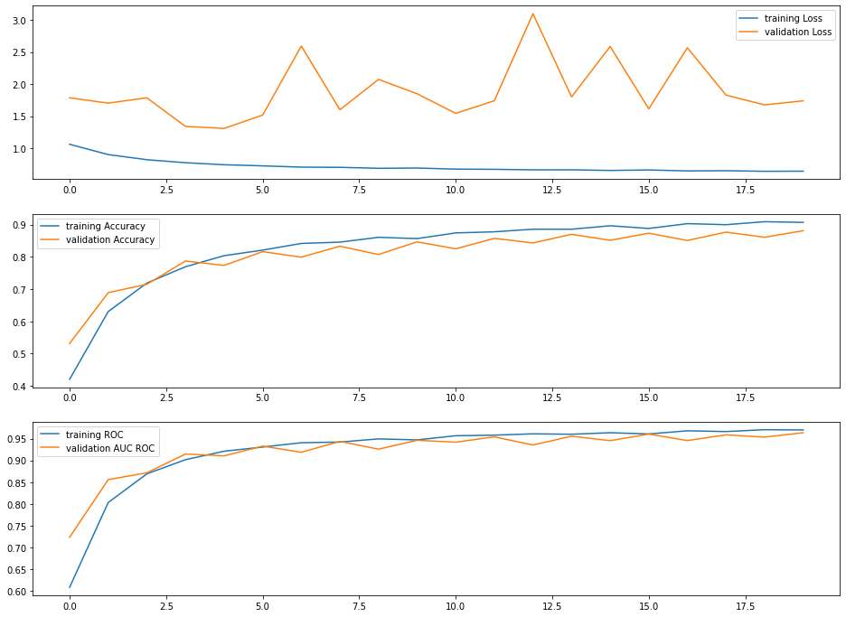
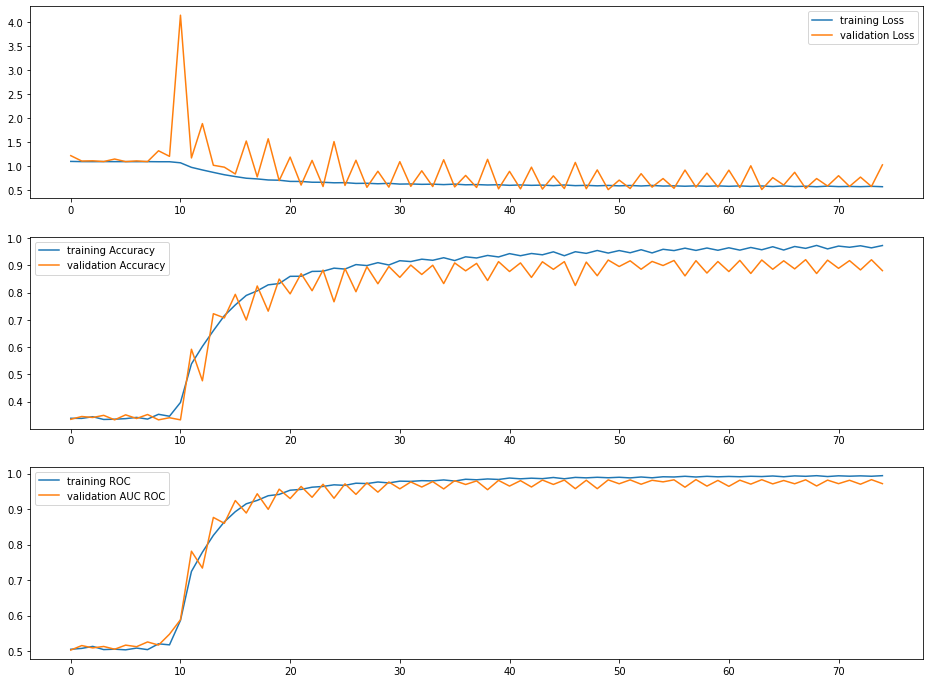

# Resnet 18 (pretrained)
## Loss, accuracy and AUC ROC

## ROC 

# Resnet 34 (pretrained)
## Loss, accuracy and AUC ROC

## ROC 

# Resnet 50 (pretrained)
## Loss, accuracy and AUC ROC

## ROC 

# Resnet 118 (pretrained)
## Loss, accuracy and AUC ROC

## ROC 

# Efficient Net b2 (pretrained)
## Loss, accuracy and AUC ROC

## ROC 

# Efficient Net b2 (pretrained)
## Loss, accuracy and AUC ROC

## ROC 

# Efficient Net b2 (pretrained)
## Loss, accuracy and AUC ROC

## ROC 

# Efficient Net b2 (pretrained)
## Loss, accuracy and AUC ROC

## ROC 

# Resnet 18 (scratch)
## Loss, accuracy and AUC ROC

